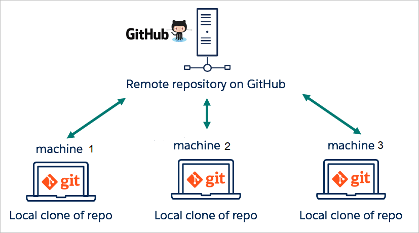
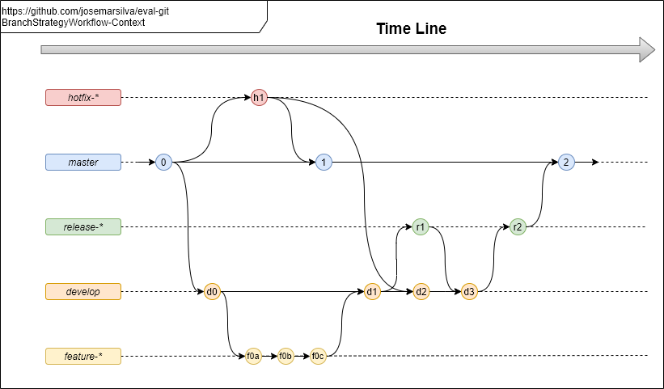
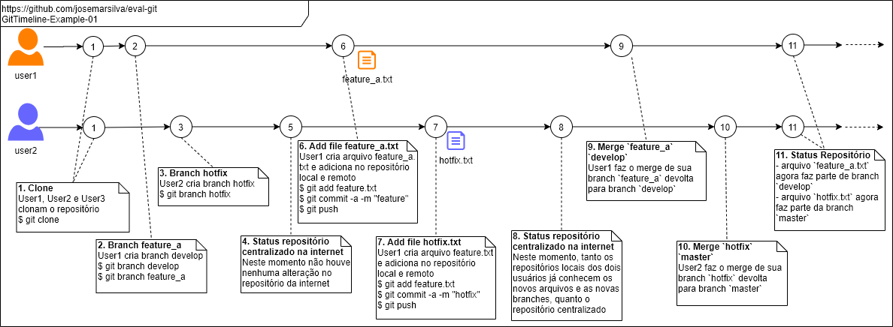
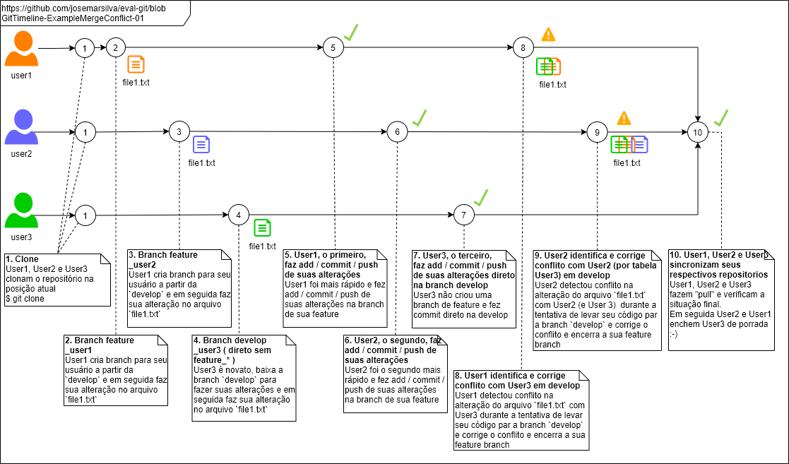

# README - eval-git

## 1. Introdução

Este repositório contém uma demonstração de avaliação das diversas funcionalidades da ferramenta **Git**:

---
## 2. Documentação

### 2.1. O que é o Git

* Git é uma ferramenta __OpenSource__ de controle __distribuído__ de de códigos fontes.

### 2.2. O que este projeto vai explorar

O objetivo deste projeto é explorar os principais conceitos, comandos e cenários possíveis.

* [Instalação](#31-instalação)
* [Documentação e Guias](#32-documentação-e-guias)
* [Inicializando repositório](#33-inicializando-repositório)
* [Criando primeiro arquivo no repositorio](#34-criando-primeiro-arquivo-no-repositorio)
* [Alterando conteúdo de arquivo](#35-alterando-conteúdo-de-arquivo)
* [Desistindo de alterações e revertendo alterações](#37-desistindo-de-alterações-e-revertendo-alterações)
  * [Cenário 1: Desistindo da criação de um arquivo local](#371-cenário-1-desistindo-da-criação-de-um-arquivo-local)
  * [Cenário 2: Desistindo de adicionar um arquivo ao repositório local](#372-cenário-2-desistindo-de-adicionar-um-arquivo-ao-repositório-local)
  * [Cenário 3: Removendo um arquivo do repositorio local](#373-cenario-3-removendo-um-arquivo-do-repositorio-local)
  * [Cenário 4: Removendo um arquivo do repositorio centralizado](#374-cenário-4-removendo-um-arquivo-do-repositorio-centralizado)
* [Estratégia de gerenciamento de branches](#38-estratégia-de-gerenciamento-de-branches)
  * [Branches: master, develop, feature, release e hotfix](#381-branches-master-develop-feature-release-e-hotfix)
  * [Cenário 5: Trabalhando simultaneamente com mais de uma branch](#39-cenário-5-trabalhando-simultaneamente-com-mais-de-uma-branch)
  * [Cenário 6: Trabalhando com conflito em alterações](#310-cenário-6-trabalhando-com-conflito-em-alterações)
* [Uso avançado do Git](#4-uso-avançado-do-git)
  * [Cenário 7: Corrigindo mensagem commit](#41-cenário-7---corrigindo-mensagem-commit)
  * [Cenário 8: Consolidando vários commits em um único](#42-cenário-8---consolidando-vários-commits-em-um-único)
  * [Cenário 9: Remover um arquivo do stage de commit](#43-cenário-9---remover-um-arquivo-do-stage-de-commit)
  * [Cenário 10: Escolher os arquivo do stage para commit em modo iterativo](#4-cenário-10---escolher-os-arquivo-do-stage-para-commit-em-modo-iterativo)
  * [Cenário 11: Separar as alterações de um mesmo arquivo em dois commits distintos](#45-cenário-11---separar-as-alterações-de-um-mesmo-arquivo-em-dois-commits-distintos)
  * [Cenário 12: Usando Git para arquivos binários](#46-cenário-12---usando-git-para-arquivos-binários)
* Situações comuns
  * Ignorar arquivos
  * Ignorar arquivos após terem sido registrados acidentalmente no repositório
* Normas, Padrões, Convenções, Melhores Práticas, Lições Aprendidas, Deslizes e Vexames


---
## 3. Projeto Demonstração

### 3.1. Instalação

* Em [https://git-scm.com/](https://git-scm.com/) você encontra link para download e instalação da última versão do Git (gratuita)
* Em [https://github.com](https://github.com) você encontra um serviço de repositório centralizado do Git (gratuito)

#### 3.1.1. Pré-requisitos

Os pré-requisitos necessários para você continuar são:
* Uma ferramenta _Git Client_ de linha de comando
* Uma conta ativa em um serviço de _Git_ público: https://github.com/ ou https://gitlab.com/ ou https://bitbucket.org/


### 3.2. Documentação e Guias

* [Handbook](https://guides.github.com/introduction/git-handbook/)
* [Guia de comandos muitos básicos](https://github.github.com/training-kit/downloads/pt_BR/github-git-cheat-sheet/)
* [Guia de uso de branches com Git](https://learngitbranching.js.org/)
* [Laboratório de aprendizado do Git](https://lab.github.com/)
* [Laboratório Github](https://youtu.be/9S0p8YMQzsM)
* [Guia dos principais comandos](https://help.github.com/en#dotcom)
* [Git Manual de Bolso](https://ndpsoftware.com/git-cheatsheet.html)

#### 3.2.1. O mínimo que você precisa saber para começar

* Sobre repositório local e remoto



* Sobre os comandos


### 3.3. Inicializando repositório

#### 3.3.1. (Opção 1) Repositório local em sua máquina

* Incializando um repositório [`git init`](https://help.github.com/en/articles/adding-an-existing-project-to-github-using-the-command-line)

```cmd
C:\> REM Step-01: Criando pasta base do repositorio e a pasta do projeto
C:\> md c:\githome
C:\> cd c:\githome
C:\> md eval-git
C:\..\eval-git> git init
Initialized empty Git repository in C:/GitHome/eval-git/.git/
C:\> 
```

#### 3.3.2. (Opção 2): Pela interface Web do serviço GitHub e clonagem do repositório

* Criando repositório pela interface Web do GitHub
  * Faça o login em https://github.com
  * Siga os passos a seguir


* Clonando o repositório do GitHub


#### 3.3.3. (Opção 3): Pela interface Web do serviço GitLab e clonagem do repositório

* Criando repositório pela interface Web do GitLab
  * Faça o login em https://gitlab.com
  * Siga os passos a seguir


* Clonando o repositório do GitLab


```cmd
C:\..\eval-git> git clone https://gitlab.com/josemarsilva/eval-git.git
Cloning into 'eval-git'...
remote: Enumerating objects: 4, done.
remote: Counting objects: 100% (4/4), done.
remote: Compressing objects: 100% (4/4), done.
remote: Total 4 (delta 0), reused 0 (delta 0), pack-reused 0
Unpacking objects: 100% (4/4), done.
```


#### 3.4. Configurando seu usuario e senha

* Configure corretamente seu nome completo e e-mail
* São 2 estratégias de configuração de usuário:
  * Global: Unica para a máquina client
  * Local: Personalizada para o usuario logado (preferencia)
* Configure corretamente seu nome e endereço de e-mail para
* Há situações em repositórios locais de empresa onde você precise desabilitar a verificação de protocolo SSL por causa de certificados locais auto-assinado

```cmd
git config --local user.name "Nome Sobrenome"
git config --local user.email "emailaddress@dominio.com.br"
git config http.sslVerify "false"
git config --list
```


### 3.4. Criando primeiro arquivo no repositorio

* Criando primeiro arquivo para o controle de arquivos
* Identificando os arquivos que fazem e que não fazem parte do controle do repositorio [`git status`](https://help.github.com/en/articles/about-status-checks)
* Criar um repositorio público no GitHub
* Adicionando-o ao controle do repositório [`git add`](https://help.github.com/en/articles/adding-a-file-to-a-repository) e [`git commit`](https://git-scm.com/docs/git-diff)
* Sincronizando com o repositório centralizado do GitHub [`git remote add`](https://help.github.com/en/articles/adding-a-remote)

```cmd
C:\..\eval-git> echo # eval-git >> README.md
C:\..\eval-git> git status
On branch master

No commits yet

Untracked files:
  (use "git add <file>..." to include in what will be committed)

        README.md
        doc/

nothing added to commit but untracked files present (use "git add" to track)
C:\..\eval-git> git add .
C:\..\eval-git> git commit -a -m "primeiro commit"
[master (root-commit) 4100414] first commit
 1 file changed, 61 insertions(+)
 create mode 100644 README.md
 
C:\..\eval-git> git status
```

#### Opção 1 (somente): Adicionando repositório remoto ao seu repositório local

* Relacionando um repositorio remoto ao seu repositório (até então somente) local

 

 

```cmd
C:\..\eval-git> git remote add origin https://github.com/josemarsilva/eval-git.git
C:\..\eval-git> git push -u origin master
Enumerating objects: 3, done.
Counting objects: 100% (3/3), done.
Delta compression using up to 4 threads
Compressing objects: 100% (2/2), done.
Writing objects: 100% (3/3), 1.03 KiB | 1.03 MiB/s, done.
Total 3 (delta 0), reused 0 (delta 0)
To https://github.com/josemarsilva/eval-git.git
 * [new branch]      master -> master
Branch 'master' set up to track remote branch 'master' from 'origin'.
```


#### Opção 1, 2 e 3: Subindo os arquivos locais para o repositorio

```cmd
C:\..\eval-git> git push
Enumerating objects: 3, done.
Counting objects: 100% (3/3), done.
Delta compression using up to 4 threads
Compressing objects: 100% (2/2), done.
Writing objects: 100% (3/3), 1.03 KiB | 1.03 MiB/s, done.
Total 3 (delta 0), reused 0 (delta 0)
To https://github.com/josemarsilva/eval-git.git
 * [new branch]      master -> master
Branch 'master' set up to track remote branch 'master' from 'origin'.
```


### 3.5. Alterando conteúdo de arquivo

* Alterando o conteúdo do arquivo
* Identificando que o conteúdo de um dos arquivos foi alterado e não está sincronizado com o repositorio [`git status`](https://git-scm.com/docs/git-status)
* Garantir que as alterações sejam sincronizadas com o repositorio, inclusive o repositório externo à sua máquina no GitHub [`git commit`](https://git-scm.com/docs/git-commit) [`git push`](https://git-scm.com/docs/git-push)

```cmd
C:\..\eval-git> echo passei por aqui >> README.md
C:\..\eval-git> git status
On branch master
Your branch is up to date with 'origin/master'.

Changes not staged for commit:
  (use "git add <file>..." to update what will be committed)
  (use "git checkout -- <file>..." to discard changes in working directory)

        modified:   README.md

no changes added to commit (use "git add" and/or "git commit -a")


C:\..\eval-git> git commit -a -m "."
[master 7cbddaa] .
 1 file changed, 20 insertions(+), 1 deletion(-)

C:\..\eval-git> git push
Enumerating objects: 5, done.
Counting objects: 100% (5/5), done.
Delta compression using up to 4 threads
Compressing objects: 100% (2/2), done.
Writing objects: 100% (3/3), 732 bytes | 732.00 KiB/s, done.
Total 3 (delta 1), reused 0 (delta 0)
remote: Resolving deltas: 100% (1/1), completed with 1 local object.
To https://github.com/josemarsilva/eval-git.git
   1f973ad..7cbddaa  master -> master
```


### 3.6. Clonando um repositorio de um Git público em sua máquina local

* Obtenha a url do projeto no seu repositório público de [Github](https://github.com/josemarsilva/eval-git). 
* Em seguida execute o comando [`git clone`](https://git-scm.com/docs/git-clone)
* Lembre-se: O clone não pode ser feito sobre um sub diretório que já existe
* Este `clone` é opcional porque o repositório de sua máquina local acabou de ser atualizado

 

```cmd
C:\..\workspace> git clone https://github.com/josemarsilva/eval-git.git
Cloning into 'eval-git'...
remote: Enumerating objects: 4, done.
remote: Counting objects: 100% (4/4), done.
remote: Compressing objects: 100% (4/4), done.
remote: Total 4 (delta 0), reused 0 (delta 0), pack-reused 0
Unpacking objects: 100% (4/4), done.
```


### 3.7. Desistindo de alterações e revertendo alterações

Nesta tópico vamos aprender as [inúmeras possibilidades de desfazer alterações](https://docs.gitlab.com/ee/topics/git/numerous_undo_possibilities_in_git/)

* Criando e commitando no repositorio remoto 3 arquivos para exercícios com um único conteúdo "Initialized". 

```cmd
C:\..\eval-git> echo Initialized > file1.txt
C:\..\eval-git> echo Initialized > file2.txt
C:\..\eval-git> echo Initialized > file3.txt
C:\..\eval-git> git add .
C:\..\eval-git> git commit -a -m "file1.txt file2.txt file3.txt"
C:\..\eval-git> git push
C:\..\eval-git> git pull
```

#### 3.7.1. Cenário 1: Desistindo da criação de um arquivo local

* crie um arquivo `file4.txt`
* identifique que o arquivo não faz parte do controle do repositorio [`git status`](https://help.github.com/en/articles/about-status-checks)
* remova `del file4.txt` o arquivo e verifique novamente o controle do repositorio

```cmd
C:\..\eval-git> echo Initialized > file4.txt
C:\..\eval-git> git status
   : 
Untracked files:
  (use "git add <file>..." to include in what will be committed)

        file4.txt
   : 
C:\..\eval-git> del file4.txt
C:\..\eval-git> git status
   : 
On branch master
Your branch is up to date with 'origin/master'.

nothing to commit, working tree clean
   : 
```

#### 3.7.2. Cenário 2: Desistindo de adicionar um arquivo ao repositório local

* crie um arquivo `file5.txt`
* identifique que o arquivo não faz parte do controle do repositorio [`git status`](https://help.github.com/en/articles/about-status-checks)
* adicione o arquivo no controle do repositório [`git add`](https://help.github.com/en/articles/adding-a-file-to-a-repository)
* identifique que o arquivo `file5.txt` é um novo arquivo do controle do repositorio mas ainda não foi armazenado no repositorio [`git status`](https://help.github.com/en/articles/about-status-checks)
* desista das alterações locais, podendo recupera-la mais tarde  [`git stash`](https://git-scm.com/docs/git-stash)
* verifique o status das alteraçoes locais no controle do repositório [`git status`](https://help.github.com/en/articles/about-status-checks)
* procure o arquivo `file5.txt` no diretorio. Observe que depois do `git stash` o arquivo não está mais no diretório
* descarte as alterações locais (permanentemente) de um arquivo [`git checkout -- <file>`](https://git-scm.com/docs/git-checkout)
* descarte todas as alterações locais de todos os aquivos permanentemente [`git reset --hard`](https://git-scm.com/docs/git-reset)

```cmd
C:\..\eval-git> echo Initialized > file5.txt
C:\..\eval-git> git status
  :
Untracked files:
  (use "git add <file>..." to include in what will be committed)

        file5.txt
  :
C:\..\eval-git> git add .
C:\..\eval-git> git status
  :
Changes to be committed:
  (use "git reset HEAD <file>..." to unstage)

        new file:   file5.txt
  :
C:\..\eval-git> git stash
Saved working directory and index state WIP on master: 239353a >
C:\..\eval-git> git status
  :
On branch master
Your branch is up to date with 'origin/master'.

nothing to commit, working tree clean
  :
```


#### 3.7.3. Cenário 3: Removendo um arquivo do repositorio local

* crie um arquivo `file6.txt`
* identifique que o arquivo não faz parte do controle do repositorio [`git status`](https://help.github.com/en/articles/about-status-checks)
* adicione o arquivo no controle do repositório [`git add`](https://help.github.com/en/articles/adding-a-file-to-a-repository)
* faça o commit do arquivo no repositório local[`git commit`](https://git-scm.com/docs/git-commit)
* remova o arquivo `file6.txt` do repositório [`git rm <file>`](https://git-scm.com/docs/git-rm)
* procure pelo arquivo `file6.txt` no diretorio local, observe que ele não está mais lá
* crie um arquivo `file7.txt`
* adicione o arquivo no controle do repositório [`git add`](https://help.github.com/en/articles/adding-a-file-to-a-repository) e faça o commit no repositório local[`git commit`](https://git-scm.com/docs/git-commit)
* remova o arquivo `file7.txt` do repositório mas mantenha a cópia local em seu diretório de trabalho [`git rm <file> --cached`](https://git-scm.com/docs/git-rm)
* procure pelo arquivo `file7.txt` no diretorio local, observe que ele ainda está lá
* identifique que o arquivo `file7.txt` não faz parte do controle do repositorio mas ainda está disponível no diretório local [`git status`](https://help.github.com/en/articles/about-status-checks)


```cmd
C:\..\eval-git> echo Initialized > file6.txt
C:\..\eval-git> git status
  :
Untracked files:
  (use "git add <file>..." to include in what will be committed)

        file6.txt
  :
C:\..\eval-git> git add file6.txt
C:\..\eval-git> git commit -a -m "file6.txt"
C:\..\eval-git> git status
C:\..\eval-git> git rm file6.txt
C:\..\eval-git> dir file6.txt
Arquivo nao encontrado
C:\..\eval-git> echo Initialized > file7.txt
C:\..\eval-git> git add file7.txt
C:\..\eval-git> git commit -a -m "file7.txt"
C:\..\eval-git> git rm file7.txt --cached
C:\..\eval-git> git status
  :
On branch master
Your branch is up to date with 'origin/master'.

Changes to be committed:
  (use "git reset HEAD <file>..." to unstage)

        deleted:    file7.txt

Untracked files:
  (use "git add <file>..." to include in what will be committed)

        file7.txt
  :
C:\..\eval-git> git commit -a -m "rm file7.txt"
C:\..\eval-git> dir file7.txt
  :
09/06/2019  17:25                14 file7.txt
  :
C:\..\eval-git> del file7.txt
```

#### 3.7.4. Cenário 4: Removendo um arquivo do repositorio centralizado

* crie um arquivo `file8.txt`
* adicione o arquivo no controle do repositório [`git add`](https://help.github.com/en/articles/adding-a-file-to-a-repository) e faça o commit do arquivo no repositório local[`git commit`](https://git-scm.com/docs/git-commit)
* empurre o arquivo para o repositorio centralizado [`git push`](https://git-scm.com/docs/git-push)
* remova o arquivo `file8.txt` do repositório local [`git rm <file>`](https://git-scm.com/docs/git-rm)
* faça o commit do arquivo no repositório local[`git commit`](https://git-scm.com/docs/git-commit)
* empurre o arquivo para o repositorio centralizado [`git push`](https://git-scm.com/docs/git-push)
* procure pelo arquivo `file8.txt` no diretorio local, observe que ele não está mais lá
* procure pelo arquivo `file8.txt` no diretorio remoto

```cmd
C:\..\eval-git> echo Initialized > file8.txt
C:\..\eval-git> git add file8.txt
C:\..\eval-git> git commit -a -m "file8.txt" 
C:\..\eval-git> git push
   :
Enumerating objects: 5, done.
Counting objects: 100% (5/5), done.
Delta compression using up to 4 threads
Compressing objects: 100% (3/3), done.
Writing objects: 100% (3/3), 367 bytes | 367.00 KiB/s, done.
Total 3 (delta 2), reused 0 (delta 0)
remote: Resolving deltas: 100% (2/2), completed with 2 local objects.
remote: This repository moved. Please use the new location:
remote:   https://github.com/josemarsilva/eval-git.git
To https://github.com/josemarsilva/eval-github.git
   51873a1..44cbcb4  master -> master
   :
C:\..\eval-git> git rm file8.txt
C:\..\eval-git> git commit -a -m "rm file8.txt" 
C:\..\eval-git> git push
C:\..\eval-git> dir file8.txt
Arquivo não encontrado
```

#### 3.7.5. Cenário 5: Desistindo de tudo

* Este cenário é como o botão de pânico, você fez muitas alterações ruins e quer jogar tudo fora
* Há uma forma muito rápida, simples e fácil: apagar tudo e clonar novamente (faremos no próximo exercício)
* Enquanto você é novato não é vergonhoso ou vexaminoso, mas aprenda a entender e atacar a causa raiz: porque o caos se instalou?


### 3.8. Estratégia de gerenciamento de branches

 

#### 3.8.1. Branches: master, develop, feature, release e hotfix

#### a. master
  * pronto para produção
  * vive "para sempre"

#### b. develop
  * último desenvolvimento pronto para instalação em ambiente de teste
  * criado a partir da __master__

#### c. feature
  * suporte a funcionalidade
  * mais comum e familiar às pessoas porque elas normalmente trabalham nesta branch
  * criado a partir da __develop__
  * deve finalizar com merge em __develop__;

#### d. release
  * suporte a preparação do trabalhao que irá para próxima versão
  * criado a partir da __develop__
  * deve finalizar com merge em __develop__ e __master__
  * convenção de nomes: __release-*__

#### e. hotfix
  * mudanças críticas em produção
  * criado a partir da __master__
  * deve finalizar com merge em __master__ e __develop__
  * convenção de nomes: __hotfix-*__


#### 3.9. Cenário 5: Trabalhando simultaneamente com mais de uma branch

* Suponha o cenário onde existam 2 usuários simultâneos: user1 e user2. Para simular o cenário, vamos criar 2 (dois subdiretorios) um para cada um deles.
* Todos os usuários, `user1`, `user2` e `user3` vão fazer um `git clone` da posição atual do repositório [`git clone`](https://git-scm.com/docs/git-clone)
* Vamos listar o conteúdo dos diretórios dos usuários e observar que todos estão com os mesmos conteúdos

```cmd
C:\..\workspace> md \githome\user1
C:\..\workspace> md \githome\user2
C:\..\workspace> md \githome\user3

C:\..\user1> cd \githome\user1
C:\..\user1> git clone https://github.com/josemarsilva/eval-git.git
C:\..\user1> cd \githome\user2
C:\..\user2> git clone https://github.com/josemarsilva/eval-git.git
C:\..\user2> cd \githome\user3
C:\..\user3> git clone https://github.com/josemarsilva/eval-git.git
C:\> dir \githome\user1\eval-git
C:\> dir \githome\user2\eval-git
C:\> dir \githome\user3\eval-git
     :
19/06/2019  17:58                14 file1.txt
19/06/2019  17:58                14 file2.txt
19/06/2019  17:58                14 file3.txt
19/06/2019  17:58            23.831 README.md
     :
C:\> type \githome\user1\eval-git\file1.txt
C:\> type \githome\user1\eval-git\file2.txt
C:\> type \githome\user1\eval-git\file3.txt
     :
Initialized
     :
```

* Ambos usuários `user1` e `user2` vão trabalhar sobre o mesmo projeto `eval-git` em branches separadas adotando a [Estratégia de gerenciamento de branches](#38-estratégia-de-gerenciamento-de-branches). Na figura abaixo veremos os comandos das atividades que eles vão executar:
* Neste ponto nenhuma das branches fixas da estratégia de branches ( develop, hotfix, feature, release, etc ) foi criada previamente, vamos deixar para cada um dos usuários criá-las conforme a necessidade

 

* No(s) pontos: ( `1`, `2` ), O usuário `user1` foi alocado para desenvolver uma nova funcionalidade chamada "a". Ele cria as branches de seu desenvolvimento. [`git branch`](https://git-scm.com/docs/git-branch)  e [`git checkout <nome-da-branch>`](https://git-scm.com/docs/git-checkout) 

```cmd
C:\> cd \githome\user1\eval-git
C:\user1\eval-git> git branch develop
C:\user1\eval-git> git checkout develop
Switched to branch 'develop'
C:\user1\eval-git> dir
  :
12/06/2019  23:30                14 file1.txt
12/06/2019  23:30                14 file2.txt
12/06/2019  23:30                14 file3.txt
12/06/2019  23:30            16.874 README.md
  :
C:\user1\eval-git> git branch feature_a
C:\user1\eval-git> git checkout feature_a
Switched to branch 'feature_a'
C:\user1\eval-git> dir
  :
12/06/2019  23:30                14 file1.txt
12/06/2019  23:30                14 file2.txt
12/06/2019  23:30                14 file3.txt
12/06/2019  23:30            16.874 README.md
  :
C:\user1\eval-git> git status
On branch feature_a
nothing to commit, working tree clean
C:\user1\eval-git> git branch
  develop
* feature_a
  master
```

* No(s) pontos: ( `1`, `3` ), o usuário `user2` foi convocado para resolver um problema urgente em produção

```cmd
C:\> cd \githome\user2\eval-git
C:\user2\eval-git> git branch hotfix
C:\user2\eval-git> git checkout hotfix
Switched to branch 'hotfix'
C:\user2\eval-git> dir
  :
12/06/2019  23:30                14 file1.txt
12/06/2019  23:30                14 file2.txt
12/06/2019  23:30                14 file3.txt
12/06/2019  23:30            16.874 README.md
  :
C:\user2\eval-git> git branch
* hotfix
  master
```

* No(s) pontos: ( `5` ), onde as alterações das branches foram feitas localmente, ainda não há nenhum vestígio de mudanças no repositório git da internet. As criações das branches foram feitas localmente e ainda não foi feito `commit` no repositório local e nem `push` para o repositório central.

 


* No(s) pontos: ( `6` ), O `user1` cria um novo arquivo `feature_a.txt` para resolver a sua nova feature. Em seguida adiciona ao repositório local e faz commit em seu repoistório local.

```cmd
C:\> cd \githome\user1\eval-git
C:\user1\eval-git> git branch
  develop
* feature_a
  master
  
C:\user1\eval-git> echo desenvolvimento nova feature > feature_a.txt
C:\user1\eval-git> git add .
C:\user1\eval-git> git commit -a -m "branch feature_a, com arquivo feature_a.txt"
[feature_a 26edcbf] branch feature_a, com arquivo feature_a.txt
 1 file changed, 1 insertion(+)
 create mode 100644 feature_a.txt
C:\user1\eval-git> git push --set-upstream origin feature_a
```


* No(s) pontos: ( `7` ), o `user2` cria um novo arquivo `hotfix.txt` para resolver a sua nova feature. Em seguida adiciona ao repositório local e faz commit em seu repoistório local.

```cmd
C:\> cd \githome\user2\eval-git
C:\user2\eval-git> git branch
* hotfix
  master

C:\user2\eval-git> echo correcao urgente > hotfix.txt
C:\user2\eval-git> git add .
C:\user2\eval-git> git commit -a -m "branch hotfix com arquivo hotfix.txt"
[hotfix d930859] branch hotfix com arquivo hotfix.txt
 1 file changed, 1 insertion(+)
 create mode 100644 hotfix.txt
C:\user1\eval-git> git push --set-upstream origin hotfix
```

* No(s) pontos: ( `8` ),  as alterações de ambos usuários `user1` e `user2` em suas respectivas branches foram feitas localmente e no repositório central. Porém observe que ao consultar os arquivos da branch `master` no repositório central, ele ainda não reflete a criação dos dois novos arquivos `feature_a.txt` e `hotfix.txt`

* No(s) pontos: ( `8` ),  observe também que branch `develop` no repositório central também ainda não reflete a criação dos dois novos arquivos `feature_a.txt` e `hotfix.txt`


 

 

* No(s) pontos: ( `8` ), quando clicamos no botão de branches sobre a branch `hotfix`, o repositório já começa a mostrar o novo arquivo `hotfix.txt` desta branch. Mas observe que na branch `hotfix` ainda não existe o arquivo `feature_a` e nem o contrário, na branch `feature_a` não existe o arquivo `hotfix.txt`.

 

 


* No(s) pontos: ( `9` ), o usuário `user1` vai fazer [`merge`](https://git-scm.com/docs/git-merge) de sua(s) alteração(ões) da branch `feature_a`, onde ele implementou um novo arquivo `feature_a.txt`, para a branch `develop`. Observe que ele não vai retornar direto para a branch `master`. Ao final do ciclo de vida da `feature_a`, o usuário `user1` vai remover a branch `feature_a`.

```cmd
C:\> cd \githome\user1\eval-git
C:\..\user1\eval-git> git pull
C:\..\user1\eval-git> git branch
  develop
* feature_a
  master
C:\..\user1\eval-git> git checkout develop
C:\..\user1\eval-git> git merge feature_a
Updating e224d8d..26edcbf
Fast-forward
 feature_a.txt | 1 +
 1 file changed, 1 insertion(+)
 create mode 100644 feature_a.txt
C:\..\user1\eval-git> git status
On branch develop
nothing to commit, working tree clean
C:\..\user1\eval-git> git push --set-upstream origin develop
C:\..\user1\eval-git> git branch
* develop
  feature_a
  master
C:\..\user1\eval-git> git branch -d feature_a
Deleted branch feature_a (was 26edcbf).
```

* No(s) pontos: ( `10` ), o usuário `user2` vai fazer [`merge`](https://git-scm.com/docs/git-merge) de sua(s) alteração(ões) da branch `hotfix`, onde ele implementou um novo arquivo `hotfix.txt`, para a branch `master`. Observe que tratou-se de uma alteração emergencial diretamente na branch `master`.

```cmd
C:\> cd \githome\user2\eval-git
C:\..\user2\eval-git> git pull
C:\..\user2\eval-git> git branch
* hotfix
  master
C:\..\user2\eval-git> git checkout master
C:\..\user2\eval-git> git pull
C:\..\user2\eval-git> git merge hotfix
Updating 7b6ef99..1ba1a3d
Fast-forward
 hotfix.txt | 1 +
 1 file changed, 1 insertion(+)
 create mode 100644 hotfix.txt
C:\..\user2\eval-git> git status
On branch master
Your branch is ahead of 'origin/master' by 2 commits.
  (use "git push" to publish your local commits)
nothing to commit, working tree clean
C:\..\user2\eval-git> git push
```

* No(s) pontos: ( `11` ), o arquivo `hotfix.txt` da branch `hotfix` agora também faz parte da branch `master`
  * O arquivo `feature_a.txt` da branch `feature_a` agora também faz parte da branch `develop`
  * A branch `feature_a` foi removida do repositorio local, mas continua armazenada no remoto
  * A branch `develop` ainda não conhece o arquivo `hotfix.txt`

 

 


#### 3.10. Cenário 6: Trabalhando com conflito em alterações

* Suponha o cenário onde existam 3 usuários simultâneos: user1, user2 e user3. Para simular o cenário, vamos criar 3 (treis subdiretorios) um para cada um deles.

 


* No(s) ponto(s) ( `1`), todos os usuários, `user1`, `user2` e `user3` vão fazer um `git clone` da posição atual do repositório [`git clone`](https://git-scm.com/docs/git-clone)
* Observe que não é possível clonar um repositório existente. Para efeito didáticos vamos desistir destas alterações locais e clonar novamente os 3 usuários, porém esta ação é opcional porque neste momento todos os diretórios estão atualizados e você também perceberá que esta decisão traz consequencias adicionais
* Vamos listar o conteúdo dos diretórios dos usuários e observar que todos estão com os mesmos conteúdos

```cmd
C:\..\user1> cd \githome\user1
C:\..\user1> git clone https://github.com/josemarsilva/eval-git.git
C:\..\user1> cd \githome\user2
C:\..\user2> git clone https://github.com/josemarsilva/eval-git.git
C:\..\user2> cd \githome\user3
C:\..\user3> git clone https://github.com/josemarsilva/eval-git.git
C:\> dir \githome\user1\eval-git
C:\> dir \githome\user2\eval-git
C:\> dir \githome\user3\eval-git
     :
19/06/2019  17:58                14 file1.txt
19/06/2019  17:58                14 file2.txt
19/06/2019  17:58                14 file3.txt
19/06/2019  17:58                19 hotfix.txt
19/06/2019  17:58            23.831 README.md
     :
C:\> type \githome\user1\eval-git\file1.txt
C:\> type \githome\user1\eval-git\file2.txt
C:\> type \githome\user1\eval-git\file3.txt
     :
Initialized
     :
```

* Observe também que quando fizemos a clonagem nova, somente a branch `master` foi baixada para o repositório local
* Vamos listar as branchs que cada um dos usuários está vendo após o `clone`

```cmd
C:\..\user1> cd \githome\user1\eval-git
C:\..\user1> git branch
* master
  
C:\..\user2> cd \githome\user2\eval-git
C:\..\user2> git branch
* master

C:\..\user3> cd \githome\user3\eval-git
C:\..\user2> git branch
* master
```

* Em seguida vamos restaurar com `checkout` as branch `develop` para cada um dos usuários

```cmd
C:\..\user1> cd \githome\user1\eval-git
C:\..\user1> git checkout develop
Switched to a new branch 'develop'
Branch 'develop' set up to track remote branch 'develop' from 'origin'.

C:\..\user1> git branch
* develop
  master
  
C:\..\user2> cd \githome\user2\eval-git
C:\..\user2> git checkout develop
Switched to a new branch 'develop'
Branch 'develop' set up to track remote branch 'develop' from 'origin'.

C:\..\user2> git branch
* develop
  master
  
C:\..\user3> cd \githome\user3\eval-git
C:\..\user3> git checkout develop
Switched to a new branch 'develop'
Branch 'develop' set up to track remote branch 'develop' from 'origin'.

C:\..\user3> git branch
* develop
  master
  
```

* No(s) ponto(s) ( `2`, `3` e `4`), simultaneamente, os 3 usuários `user1`, `user2` e `user3` que durante suas atividades necessitam alterar o arquivo `file1.txt`. Todos os 3 usuários irão modificar o mesmo arquivo `file1.txt':
  * `user1`, seguindo o procedimento vai criar uma branch `feature_user1` e fazer sua alteração no arquivo `file1.txt` na branch `feature_user1`.
  * `user2`, seguindo o procedimento vai criar uma branch `feature_user2` e fazer sua alteração no arquivo `file1.txt` na branch `feature_user1`.
  * `user3`, não conhece direito os procedimentos e vai fazer sua alteração no arquivo `file1.txt` na branch `develop`.

```cmd
C:\..\user1> cd \githome\user1\eval-git
C:\..\user1> git checkout develop
C:\..\user1> git branch feature_conflict_by_user1
C:\..\user1> git checkout feature_conflict_by_user1
Switched to branch 'feature_conflict_by_user1'
C:\..\user1> git branch
  develop
* feature_conflict_by_user1
  master
C:\..\user1> cd \githome\user2\eval-git
C:\..\user2> git checkout develop
C:\..\user2> git branch feature_conflict_by_user2
C:\..\user2> git checkout feature_conflict_by_user2
Switched to branch 'feature_conflict_by_user2'
C:\..\user2> git branch
  develop
* feature_conflict_by_user2
  master
C:\..\user2> cd \githome\user3\eval-git
C:\..\user3> git checkout develop
C:\..\user3> git branch
* develop
  master
C:\..\user1> cd \githome\user1\eval-git # user1
```

* ... e fazem suas respectivas alterações no mesmo arquivo `file1.txt`

```cmd
C:\..\user1> cd \githome\user1\eval-git
C:\..\user1> echo user1 was here >> file1.txt
C:\..\user1> type file1.txt
Initialized
user1 was here
C:\..\user2> cd \githome\user2\eval-git
C:\..\user2> echo user2 was here >> file1.txt
C:\..\user2> type file1.txt
Initialized
user2 was here
C:\..\user3> cd \githome\user3\eval-git
C:\..\user3> echo user3 was here >> file1.txt
C:\..\user3> type file1.txt
Initialized
user3 was here
```

* No(s) ponto(s) ( `5`), o usuário **user1** faz commit de suas alterações e abre um `pull request` de suas alterações

```cmd
C:\..\user1> cd \githome\user1\eval-git
C:\..\user1> git status
On branch feature_conflict_by_user1
Changes not staged for commit:
  (use "git add <file>..." to update what will be committed)
  (use "git checkout -- <file>..." to discard changes in working directory)
        modified:   file1.txt
no changes added to commit (use "git add" and/or "git commit -a")
C:\..\user1> git commit -a -m "conflict file1.txt by user1"
C:\..\user1> git push --set-upstream origin feature_conflict_by_user1
Enumerating objects: 5, done.
Counting objects: 100% (5/5), done.
Delta compression using up to 4 threads
Compressing objects: 100% (2/2), done.
Writing objects: 100% (3/3), 305 bytes | 305.00 KiB/s, done.
Total 3 (delta 1), reused 0 (delta 0)
remote: Resolving deltas: 100% (1/1), completed with 1 local object.
remote:
remote: Create a pull request for 'feature_conflict_by_user1' on GitHub by visiting:
remote:      https://github.com/josemarsilva/eval-git/pull/new/feature_conflict_by_user1
remote:
To https://github.com/josemarsilva/eval-git.git
 * [new branch]      feature_conflict_by_user1 -> feature_conflict_by_user1
Branch 'feature_conflict_by_user1' set up to track remote branch 'feature_conflict_by_user1' from 'origin'.
```

* No(s) ponto(s) ( `6`), o usuário **user2** faz commit de suas alterações e abre um `pull request` de suas alterações

```cmd
C:\..\user2> cd \githome\user2\eval-git
C:\..\user2> git commit -a -m "conflict file1.txt by user2"
C:\..\user2> git push --set-upstream origin feature_conflict_by_user2
Enumerating objects: 5, done.
Counting objects: 100% (5/5), done.
Delta compression using up to 4 threads
Compressing objects: 100% (2/2), done.
Writing objects: 100% (3/3), 307 bytes | 307.00 KiB/s, done.
Total 3 (delta 1), reused 0 (delta 0)
remote: Resolving deltas: 100% (1/1), completed with 1 local object.
remote:
remote: Create a pull request for 'feature_conflict_by_user2' on GitHub by visiting:
remote:      https://github.com/josemarsilva/eval-git/pull/new/feature_conflict_by_user2
remote:
To https://github.com/josemarsilva/eval-git.git
 * [new branch]      feature_conflict_by_user2 -> feature_conflict_by_user2
Branch 'feature_conflict_by_user2' set up to track remote branch 'feature_conflict_by_user2' from 'origin'.
```

* No(s) ponto(s) ( `7`), o usuário **user3** faz commit de suas alterações e fez `push` direto na branch `develop`

```cmd
C:\..\user3> cd \githome\user3\eval-git
C:\..\user3> git commit -a -m "conflict file1.txt by user3"
C:\..\user3> git push
Enumerating objects: 5, done.
Counting objects: 100% (5/5), done.
Delta compression using up to 4 threads
Compressing objects: 100% (2/2), done.
Writing objects: 100% (3/3), 303 bytes | 303.00 KiB/s, done.
Total 3 (delta 1), reused 0 (delta 0)
remote: Resolving deltas: 100% (1/1), completed with 1 local object.
To https://github.com/josemarsilva/eval-git.git
   26edcbf..ef9759e  develop -> develop
```

* No(s) ponto(s) ( `8` e `9`), o usuário **user1** ao tentar fazer o push de `user2`, percebe que houve [conflito](https://help.github.com/en/articles/about-pull-requests) e fica responsável por identificar as diferenças com [git diff](https://help.github.com/en/articles/differences-between-commit-views) e fazer o merge das alterações de `user2` na branch `. 
* Segue aqui mais algumas referências à documentação para resolução de conflitos:
  * [`git merge`](https://git-scm.com/book/pt-br/v1/Ramifica%C3%A7%C3%A3o-Branching-no-Git-B%C3%A1sico-de-Branch-e-Merge)
  * [How to resolve merge conflict](https://git-scm.com/docs/git-merge#_how_to_resolve_conflicts)
  


```cmd
C:\..\user1> cd \githome\user1\eval-git
C:\..\user1> git pull
remote: Enumerating objects: 8, done.
remote: Counting objects: 100% (8/8), done.
remote: Compressing objects: 100% (2/2), done.
remote: Total 6 (delta 3), reused 5 (delta 2), pack-reused 0
Unpacking objects: 100% (6/6), done.
From https://github.com/josemarsilva/eval-git
   26edcbf..ef9759e  develop    -> origin/develop
 * [new branch]      feature_conflict_by_user2 -> origin/feature_conflict_by_user2
C:\..\user1> git branch
  develop
* feature_conflict_by_user1
  feature_conflict_by_user2
  master
C:\..\user1> type file1.txt
Initialized
user1 was here
C:\..\user1> git checkout feature_conflict_by_user2
C:\..\user1> type file1.txt
Initialized
user2 was here
C:\..\user1> git diff feature_conflict_by_user1
diff --git a/file1.txt b/file1.txt
index 471cbf5..635d3fc 100644
--- a/file1.txt
+++ b/file1.txt
@@ -1,2 +1,2 @@
 Initialized
-user1 was here
+user2 was here
C:\..\user1> REM O comando de "git merge" vai juntar os dois arquivos no destino. Isto praticamente inutiliza o arquivo.
C:\..\user1> git merge feature_conflict_by_user1
Auto-merging file1.txt
CONFLICT (content): Merge conflict in file1.txt
Automatic merge failed; fix conflicts and then commit the result.
C:\..\user1> git checkout feature_conflict_by_user1
error: you need to resolve your current index first
file1.txt: needs merge
C:\..\user1> type file1.txt
Initialized
<<<<<<< HEAD
user2 was here
=======
user1 was here
>>>>>>> feature_conflict_by_user1
C:\..\user1> git branch
  develop
  feature_conflict_by_user1
* feature_conflict_by_user2
  master
  
C:\..\user1> REM "git reset --merge" vai desfazer a merja feita pelo merge padrao
C:\..\user1> git reset --merge
C:\..\user1> type file1.txt
C:\..\user1> git merge feature_conflict_by_user1
C:\..\user1> REM Editando o arquivo para resolver o confito
C:\..\user1> echo Initialized > file1.txt
C:\..\user1> echo user1 was here >> file1.txt
C:\..\user1> echo user2 was here >> file1.txt
C:\..\user1> type file1.txt
Initialized
user1 was here
user2 was here
C:\..\user1> git add file1.txt
C:\..\user1> git merge --continue
Colocar comentario
C:\..\user1> git push
Enumerating objects: 7, done.
Counting objects: 100% (7/7), done.
Delta compression using up to 4 threads
Compressing objects: 100% (2/2), done.
Writing objects: 100% (3/3), 357 bytes | 357.00 KiB/s, done.
Total 3 (delta 1), reused 0 (delta 0)
remote: Resolving deltas: 100% (1/1), completed with 1 local object.
To https://github.com/josemarsilva/eval-git.git
   62531a0..1df3f0e  feature_conflict_by_user2 -> feature_conflict_by_user2
C:\..\user1> git checkout feature_conflict_by_user1
C:\..\user1> echo Initialized > file1.txt
C:\..\user1> echo user1 was here >> file1.txt
C:\..\user1> echo user2 was here >> file1.txt
C:\..\user1> git commit -a -m "."
C:\..\user1> git push
```

* No(s) ponto(s) ( `10` ), o usuário **user1** ao tentar fazer o merge de sua branch `feature_conflict_by_user1` (que já fez merge com User2) com a branch `develop`, resolve novamente resolver o conflito.

```cmd
C:\..\user1> cd \githome\user1\eval-git
C:\..\user1> git pull
C:\..\user1> git diff develop
@@ -1,2 +1,3 @@
 Initialized
-user3 was here
+user1 was here
+user2 was here

C:\..\user1> git merge develop
Auto-merging file1.txt
CONFLICT (content): Merge conflict in file1.txt
Automatic merge failed; fix conflicts and then commit the result.
C:\..\user1> git merge --abort
C:\..\user1> echo user3 was here >> file1.txt
C:\..\user1> git status
C:\..\user1> git add file1.txt
C:\..\user1> git commit -a -m "merge feature_conflict_by_user1 vs develop"
C:\..\user1> git checkout develop
C:\..\user1> echo Initialized > file1.txt
C:\..\user1> echo user1 was here >> file1.txt
C:\..\user1> echo user2 was here >> file1.txt
C:\..\user1> echo user3 was here >> file1.txt
C:\..\user1> git commit -a -m "merge feature_conflict_by_user1 x develop"
C:\..\user1> git push
C:\..\user1> git branch -d feature_conflict_by_user1
C:\..\user1> git branch -d feature_conflict_by_user2
```


#### 4. Uso avançado do Git

##### 4.1. Cenário 7 - Corrigindo mensagem commit

Suponha que você criou um novo arquivo `file4.txt`, fez o `git add` e o `git commit` em seu stage local, mas cometeu um erro gravíssimo no texto da mensagem do commit.

```cmd
C:\..\user1> git checkout master
Your branch is up to date with 'origin/master'.
C:\..\user1> git pull
Already up to date.
C:\..\user1> echo conteudo 4 > file4.txt
C:\..\user1> git add file4.txt
C:\..\user1> git commit -m "addicionando arquivo de quatro"
[master b2fe8db] addicionando arquivo de quatro
 1 file changed, 1 insertion(+)
 create mode 100644 file4.txt
C:\..\user1> git log
commit b2fe8db260bc48ec01854ab35f2872da7d20203f (HEAD -> master)
Author: josemarsilva
Date:   Sun Mar 1 19:27:43 2020 -0300

    addicionando arquivo de quatro
  :
```

* Putz! E agora? tem como corrigir esta mensagem ou ela vai para o repositório deste jeito? Vou passar maior vergonha! Todo mundo vai rir de mim!
  * Resposta: Sim. Vamos fazer o `git commit --amend` com a mensagem certa

```cmd
C:\..\user1> git commit -m "adicionando file4.txt" --amend
C:\..\user1> git log
commit 60b592795fc656fea710c8f2756bab8a9cc4878e (HEAD -> master)
Author: josemarsilva
Date:   Sun Mar 1 19:27:43 2020 -0300

    adicionando file4.txt
  :
```


##### 4.2. Cenário 8 - Consolidando vários commits em um único

Suponha que em seu processo de desenvolvimento você teve que criar um novo arquivo `file5.txt`. Pensou que era somente este arquivo, então fez `git add .`  e `git commit`.
Porém na hora de testar, observou que precisou de outro arquivo o `file6.txt`. Novamente pensou que seria somente este, então fez `git add .`  e `git commit`.
Como TI não é uma ciência exata, você precisou de mais outro arquivo o `file7.txt`. E então fez `git add .`  e `git commit`.
Daí você notou que a sua alteração, ficou picotada em 3 commits distintos, com 3 mensagens distintas. E pensou: puxa, coitado de quem tiver que entender o que está acontecendo pelas mensagens gravadas!

```cmd
C:\..\user1> echo conteudo 5 > file5.txt
C:\..\user1> git add file5.txt
C:\..\user1> git commit -a -m "adicionando file5"
[master 4f5f81f] adicionando file5
 1 files changed, 1 insertions(+)
 create mode 100644 file5.txt
C:\..\user1>
C:\..\user1> echo conteudo 6 > file6.txt
C:\..\user1> git add file6.txt
C:\..\user1> git commit -a -m "adicionando file6"
[master 0c269d0] adicionando fi
 1 file changed, 1 insertion(+)
 create mode 100644 file6.txt
C:\..\user1>
C:\..\user1> echo conteudo 7 > file7.txt
C:\..\user1> git add file7.txt
C:\..\user1> git commit -a -m "adicionando file7"
[master 5d7be86] adicionando file7
 1 file changed, 1 insertion(+)
 create mode 100644 file7.txt
C:\..\user1> git log
commit 5d7be86c86d847bac51173e2afbc69f342670ea2 (HEAD -> master)
Author: josemarsilva <josemar.furegatti@gmail.com>
Date:   Sun Mar 1 19:49:13 2020 -0300

    adicionando file7

commit 0c269d05e23ab1b800a16c6881838f917f047e1a
Author: josemarsilva <josemar.furegatti@gmail.com>
Date:   Sun Mar 1 19:48:09 2020 -0300

    adicionando file6

commit 4f5f81f3832912d407c6098f5f7e0355373495b5
Author: josemarsilva <josemar.furegatti@gmail.com>
Date:   Sun Mar 1 19:46:13 2020 -0300

    adicionando file5
         :
```

* Será que tem jeito de juntar os 3 últimos commits com os arquivos `file5.txt`, `file6.txt` e `file7.txt` em um único pacote? Afinal eles eram para ser um único pacote!
  * Resposta: Sim

* Precisamos saber que o último commit é etiquetado como _HEAD_
* Os commits são guardados em uma estrutura de lista ligada simples e os commits anteriores podem ser referenciados de forma relativa ao _HEAD_
* Podemos navegar por esta lista ligada, referenciando de forma relativa os _últimos 3 commits_
* O commando `git reset` tem 2 opções a saber: *--hard* e *--soft*
* A opção `git reset --hard` é para ser usada quando você bagunçou tudo e quer voltar para traz, jogando tudo o que fez fora! Equivale a fazer um novo `git clone`
* A opção `git reset --soft` é para ele apenas desfazer as alterações do repositório, deixando os arquivos intactos

* Vamos corrigir ...

```cmd
C:\..\user1> git reset --soft HEAD~3
C:\..\user1> git status
n branch master
Your branch is ahead of 'origin/master' by 1 commit.
  (use "git push" to publish your local commits)

Changes to be committed:
  (use "git reset HEAD <file>..." to unstage)

        new file:   file5.txt
        new file:   file6.txt
        new file:   file7.txt
```

* Agora podemos fazer o `git add` para os 3 arquivos juntos e um único commit da alteração

```cmd
C:\..\user1> git add file5.txt file6.txt file7.txt
C:\..\user1> git commit -a -m "alteração em conjunto de file5.txt file6.txt file7.txt"
C:\..\user1> git push
```


##### 4.3. Cenário 9 - Remover um arquivo do stage de commit

* Suponha que você tenha feito alterações em vários arquivos
* Em paralelo te pediram para corrigir outro problema que envolve alterações em outros arquivos
* Para piorar a situação você alterou o README.md da documentação que não tem a ver com as alterações
* Por um deslize ou força de hábito você adicionou todas as alterações no stage com `git add .`

```cmd
C:\..\user1> echo alteracao >> file4.txt
C:\..\user1> echo alteracao >> file5.txt
C:\..\user1> echo alteracao >> file6.txt
C:\..\user1> echo alteracao >> file7.txt
C:\..\user1> echo --- >> README.md
C:\..\user1> git status
On branch master
Your branch is up to date with 'origin/master'.

Changes not staged for commit:
  (use "git add <file>..." to update what will be committed)
  (use "git checkout -- <file>..." to discard changes in working directory)

        modified:   README.md
        modified:   file4.txt
        modified:   file5.txt
        modified:   file6.txt
        modified:   file7.txt

no changes added to commit (use "git add" and/or "git commit -a")
```

* Ai então você fez o `git add .` indevido! Indevido porque vocè queria separar em 2 commits distintos: o primeiro deles com as alterações nos arquivos `file4.txt`, `file5.txt`, `file6.txt` e `file7.txt`. E o segundo com o arquivo `README.md`  

```cmd
C:\..\user1> git add .
C:\..\user1> git status
On branch master
Your branch is up to date with 'origin/master'.

Changes to be committed:
  (use "git reset HEAD <file>..." to unstage)

        modified:   README.md
        modified:   file4.txt
        modified:   file5.txt
        modified:   file6.txt
        modified:   file7.txt
```

* Será que tem jeito de remover do Stage somente o arquivo `README.md` ?
  * Resposta: Sim, vamos reverter o `README.md` do stage

```cmd
C:\..\user1> git reset -- README.md
Unstaged changes after reset:
M       README.md
C:\..\user1> git status
On branch master
Your branch is up to date with 'origin/master'.

Changes to be committed:
  (use "git reset HEAD <file>..." to unstage)

        modified:   file4.txt
        modified:   file5.txt
        modified:   file6.txt
        modified:   file7.txt

Changes not staged for commit:
  (use "git add <file>..." to update what will be committed)
  (use "git checkout -- <file>..." to discard changes in working directory)

        modified:   README.md
```


##### 4.4. Cenário 10 - Escolher os arquivo do stage para commit em modo iterativo

* Suponha que vocè tenha feito alterações em vários arquivos
* Gostaria de dividí-los em 2 commit's distintos, porque dizem respeito a assuntos distintos

```cmd
C:\..\user1> echo alteracao 1 >> file4.txt
C:\..\user1> echo alteracao 1 >> file5.txt
C:\..\user1> echo alteracao 2 >> file6.txt
C:\..\user1> echo alteracao 2 >> file7.txt
C:\..\user1> git add .
```

* Vamos adicionar os arquivos ao stage de forma iterativa com o `git add -i`

```cmd
C:\..\user1> git add -i
           staged     unstaged path
  1:       +91/-2      nothing README.md
  2:        +1/-0      nothing file4.txt
  3:        +1/-0      nothing file5.txt
  4:        +1/-0      nothing file6.txt
  5:        +1/-0      nothing file7.txt

*** Commands ***
  1: status       2: update       3: revert       4: add untracked
  5: patch        6: diff         7: quit         8: help
```

* Utilizando as opções iterativas `git add -i` vamos fazer: a) opção 3 - reverter do stage os arquivos `README.md`, `file6.txt` e `file7.txt`
* Em seguida `git commit -a -m "alteracoes pacote 1: file4.txt e file5.txt"`

```cmd
C:\..\user1> git status
On branch master
Your branch is up to date with 'origin/master'.

Changes to be committed:
  (use "git reset HEAD <file>..." to unstage)

        modified:   file4.txt
        modified:   file5.txt

Changes not staged for commit:
  (use "git add <file>..." to update what will be committed)
  (use "git checkout -- <file>..." to discard changes in working directory)

        modified:   README.md
        modified:   file6.txt
        modified:   file7.txt

C:\..\user1> git commit -m "alteracoes pacote 1: file4.txt e file5.txt"
[master 558f755] alteracoes pacote 1: file4.txt e file5.txt
 5 files changed, 121 insertions(+), 2 deletions(-)
```

* Em seguida adicionar o segundo pacote:

```cmd
C:\..\user1> git add 
```

##### 4.5. Cenário 11 - Separar as alterações de um mesmo arquivo em dois commits distintos


##### 4.6. Cenário 12 - Usando Git para arquivos binários


## I - References

* [Git Help](https://git-scm.com/)
* [Git Branch Model](https://nvie.com/posts/a-successful-git-branching-model/)
* [Git Numerosas possibilidades de defazer algo](https://docs.gitlab.com/ee/topics/git/numerous_undo_possibilities_in_git/#quickly-save-local-changes)
* [Git Merge Conflict - Youtube](https://www.youtube.com/watch?v=__cR7uPBOIk)
* [What is Source Code Managment](https://arcadsoftware.com/news-events/blog/what-is-source-code-management/)
* [Usando Git direito (não é basico) - por Fabio Akita](https://www.youtube.com/watch?v=6OokP-NE49k&t=2123s)

--- 
